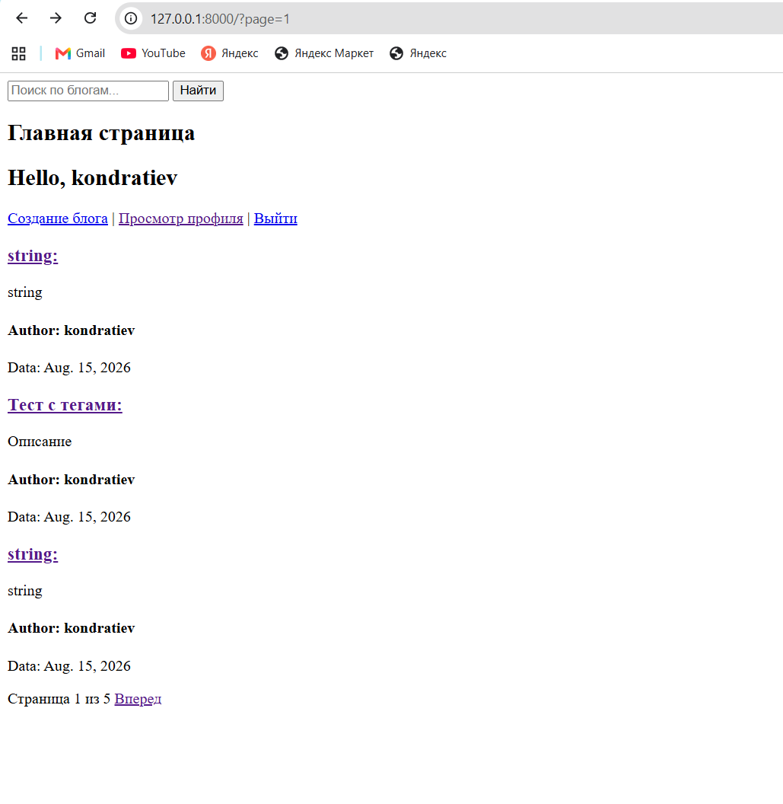
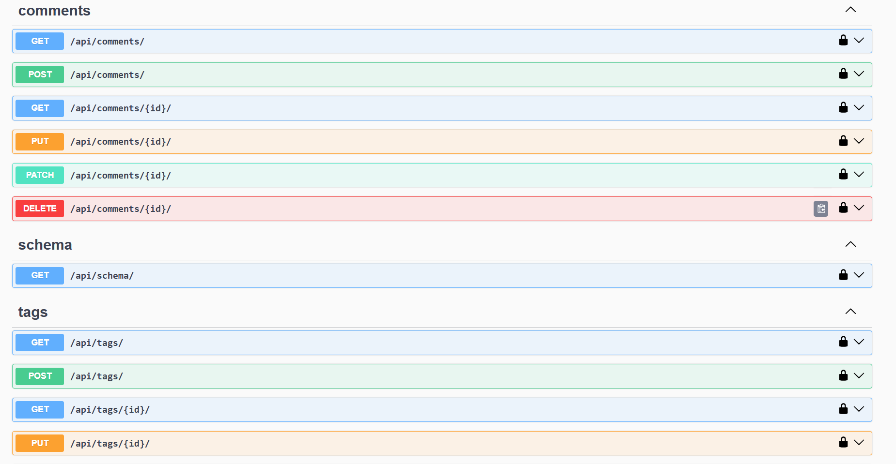
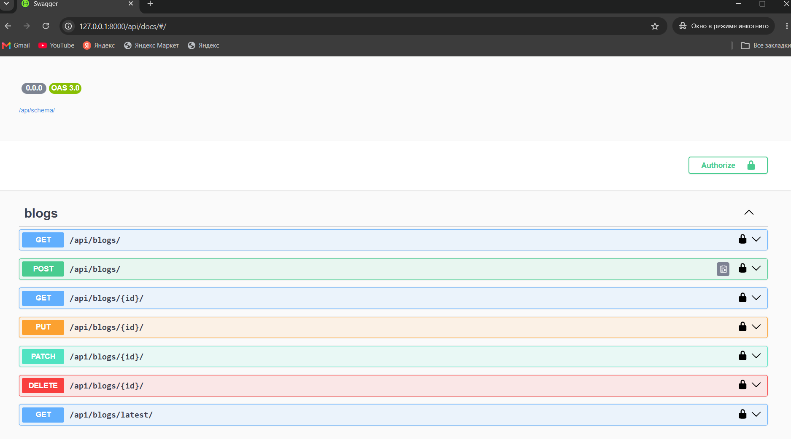

# Blog (Django Blog)

Полноценный блог-платформ с веб-интерфейсом и REST API. Пользователи могут создавать посты, добавлять теги, оставлять комментарии, редактировать профиль с аватаркой. Реализована JWT-аутентификация, поиск по постам, пагинация и автоматическое создание профиля при регистрации.

## Стек технологий

- **Backend:** Django 6.0, Django REST Framework, SimpleJWT
- **Database:** PostgreSQL
- **DevOps:** Docker, Docker Compose
- **Code Quality:** flake8
- **API Docs:** drf-spectacular (Swagger/OpenAPI)
- **Redis:** redis 8.1.0
- **Celery:** Celery 5.6.3

## Скриншоты

### Главная страница

### Swagger UI 

### Swagger UI 


## Быстрый старт (Docker)

```bash
git clone https://github.com/Stas-W1nt3R/to_do_list_django.git
cd to_do_list_django/TodoList
cp .env.example .env
docker-compose up --build
```

## Endpoints
| Endpoint              | Method           | Auth    | Описание                              |
| --------------------- | ---------------- | ------- |---------------------------------------|
| `/api/blogs/`         | GET/POST         | Нет/JWT | Список/создание блогов                |
| `/api/blogs/<id>/`    | GET/PATCH/DELETE | Нет/JWT | Детали/редакт/удаление (только автор) |
| `/api/blogs/latest/`  | GET              | Нет     | 3 последних блога                     |
| `/api/tags/`          | GET/POST         | Нет/JWT | Теги                                  |
| `/api/comments/`      | GET/POST         | Нет/JWT | Комментарии                           |
| `/api/token/`         | POST             | Нет     | Получить JWT                          |
| `/api/token/refresh/` | POST             | Нет     | Обновить JWT                          |
| `/api/blogs/<id>/comments/` | GET/POST | Нет/JWT | Комментарии к блогу                   |
| `/api/blogs/my_blogs/` | GET | JWT | Блоги текущего пользователя           |

## Фоновые задачи (Celery + Redis)

- Redis используется как брокер сообщений для Celery
- Celery worker запускается в отдельном Docker-контейнере
- Пример задачи: отправка уведомлений (заглушка, расширяется под реальные сценарии)

## Тесты
```bash
docker-compose exec web python manage.py test
```
